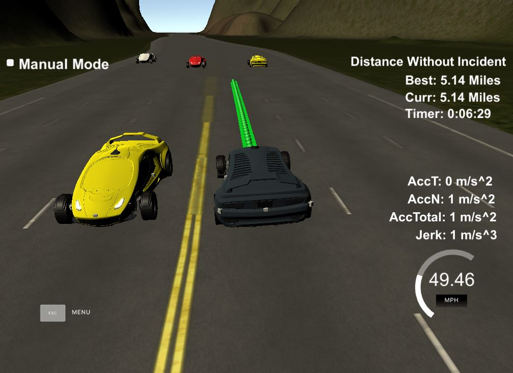

# CarND-Path-Planning-Project
Self-Driving Car Engineer Nanodegree Program Term3 Project 1

   
My code built without error with cmake .. && make and works well with the simulator. 

The following snapshot at the end of a 5.14miles run showed the car was able to drive without incident or collision. During the run, the target speed is set to 49.5mph and max acceleration and jerk are never exceeded.  The ego car changes lanes when the front car is slow and it's safe to change lanes. 

 

### Reflection 
Spline interpolation between start and end points defined helps the car run without excessive acceleration and jerk. It also helps following the speed limit during the distance to drive, and smooth lane change route. Frenet coordinates are used for simplifying road tracking.  

The lane keeping and lane change finite state machine is defined as below. The car starts at 0mph and accelerated gradually to 49.5mph. It slows down when another car is in front of it within 30 meters. Then it decides whether it's safe to change lanes by checking if there are enough space in the adjacent lane (car distance is more than +/-50m). If the car is in the middle lane, it compares the left and right space, and then decide which lane to switch to (left lane change is with higher priority). If it's not safe to change lane at that moment, the car will be slowing down to avoid collision, and watching for lane change opportunity later. 

